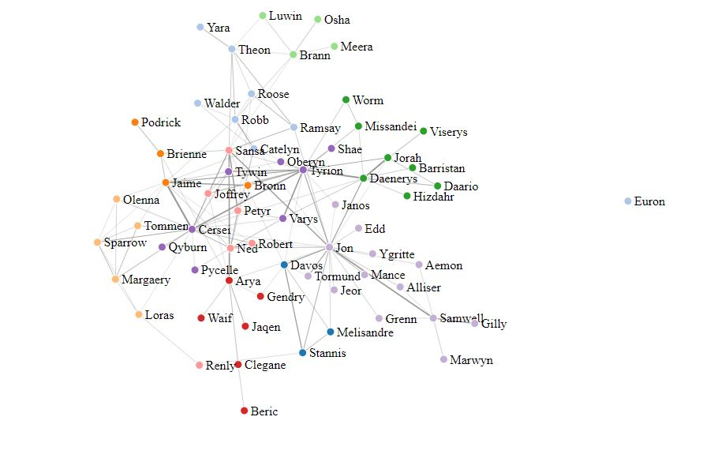
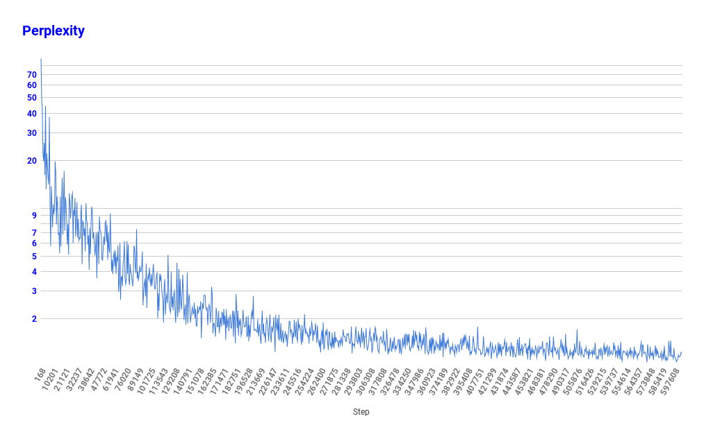
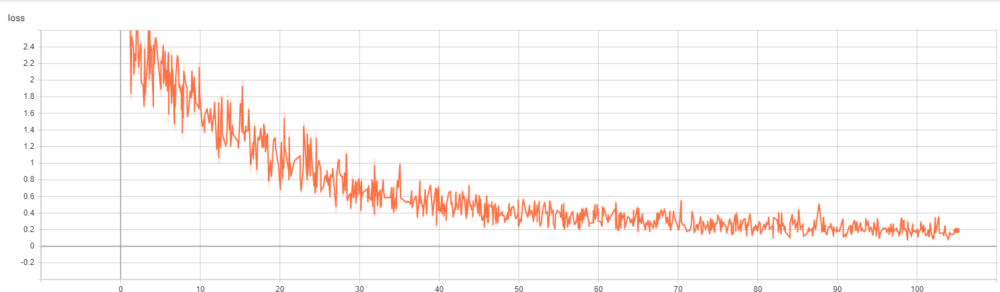
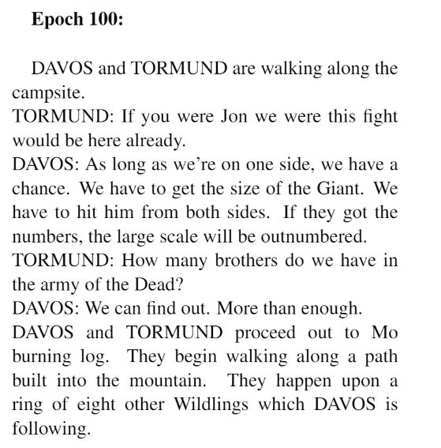
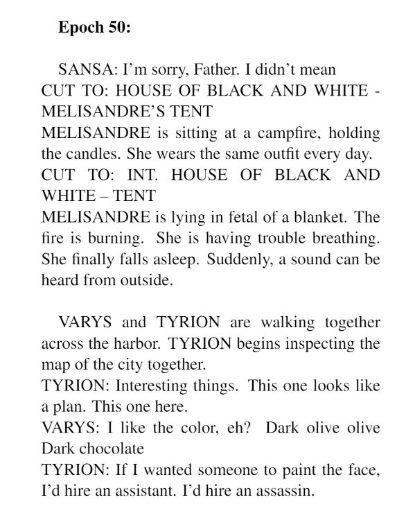

# ConvoCraft: AI-Powered Dialogue Generator with GPT-2 Language Model

This project involves the analysis of dialogues from the Game of Thrones (GoT) series using NLP techniques. The main objective is to explore how dialogues relate to characters in the series and derive insights from these relationships. Additionally, the project investigates the feasibility of using neural networks to generate dialogue scripts.

## Required Libraries to Install

Ensure you have the following Python libraries installed:

- numpy
- pandas
- matplotlib
- scikit-learn
- seaborn
- fastai
- networkx
- nltk
- gensim

## Dataset

Raw dialogues were obtained from [Genius.com](https://genius.com/artists/Game-of-thrones). The dataset consists of CSV files containing character dialogues, seasons, and chapters. For detailed data cleaning and preprocessing steps, refer to the [Final_Pipeline](Game-of-thrones-analysis/Final_Pipeline.ipynb) notebook.

## File Description

- [Final_Pipeline.ipynb](Game-of-thrones-analysis/Final_Pipeline.ipynb): Comprehensive data preparation, analysis, modeling, and scoring process.
- [GoT dialogue generator.ipynb](Game-of-thrones-analysis/GoT%20dialogue%20generator.ipynb): Use a pre-trained model to generate random GoT dialogues.
- [GoT](Game-of-thrones-analysis/GoT): Raw chapter scripts obtained from Genius.com.
- [CSV](Game-of-thrones-analysis/CSV): Cleaned CSV files containing character dialogues.

## Network Graph

Character interactions were visualized using a network graph generated from the dialogue data.

## Dialogue Generation

Dialogue generation using GPT-2 language model is demonstrated in the [GoT dialogue generator.ipynb](Game-of-thrones-analysis/GoT%20dialogue%20generator.ipynb) notebook.

## Model Training

For model training, refer to the instructions in the [runmeforallwork.ipynb](runmeforallwork.ipynb) notebook.

## GPT-2 Language Model Dialogue Generation Performance

### Perplexity

### Model Loss

## Generated Dialogue Samples

## Project Contributors

- [Md. Sajid Ahmed - 1610364042](https://github.com/sajidahmed12)
- [Zahin Akram - 1610618042](https://github.com/ZahinAkram)
- Arifuzzaman Arman - 1610551042
- Md. Rakib Imtiaz - 1610294042
